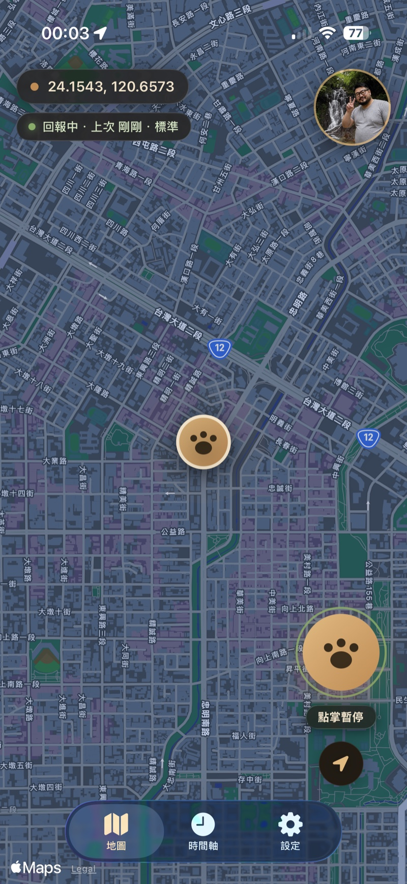
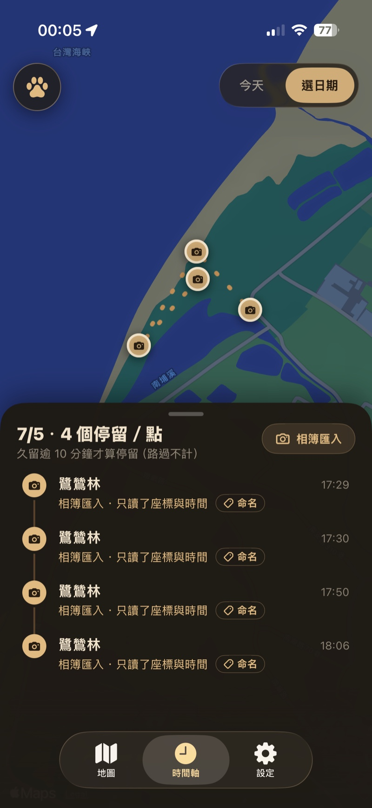
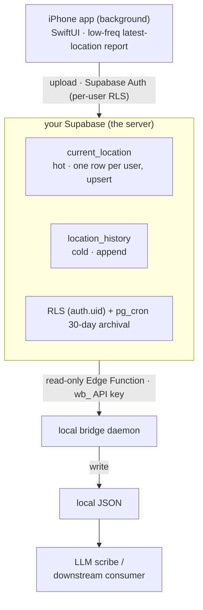

# wherebear — Be Your Own Creepy Location-Tracking Megacorp

[](LICENSE)
[](https://swift.org/)
[](https://developer.apple.com/ios/)

[正體中文](README_zh.md)

Big-company location timelines are quietly convenient: they log where you went today, when you got there, how long you stayed — and then go do… something with it, you're not entirely sure what. This does the exact same thing, except "where you've been" lives on **your own** backend, key in your hands. Basically: be your own creepy location-tracking megacorp — only this time the megacorp is you.

I built this after switching off a third party's location history and realizing the itch to know "where did I wander yesterday?" hadn't gone anywhere — I just no longer wanted to trade my entire movement trail to scratch it. So: self-host one. Coordinates only ever touch your own Supabase; who gets to see them, which tool gets to read them, is your call.

<p align="center">
  
  
</p>

## What it does

- **Phone** — a hand-rolled native iOS app that quietly reports your latest location in the background. **Low-frequency, coarse, battery-friendly** — not the per-second kind that stalks you and drains your battery on the way out (invasive, power-hungry, and not the point anyway).
- **Backend** — your own Supabase. Two tables: one for "where I am now" (upsert, always overwrites, forgets fast) and one for "where I've been" (append-only, sentimental). Archived after 30 days, restorable whenever you feel like digging up old trails.
- **Local bridge** — a small always-on daemon that pulls the latest coordinate into a local JSON file. Whoever wants it reads it: your own tools, a map app, a friend — or an LLM scribe narrating where you are.

## Architecture (calm down, it's not that complicated)



Two trust boundaries are worth a second glance. The **phone writes** with a real per-user login — RLS pins every row to `auth.uid()`, so nobody reads or writes anyone else's location. The **bridge reads** through a read-only Edge Function gated by a hashed `wb_` API key, so a downstream reader (say, an LLM scribe muttering "where are they right now?") gets the latest coordinate without ever holding your database credentials. The whole thing only touches the network in that one bridge hop.

Stack: native Swift (no cross-platform detour) + Supabase-native (BaaS — DB/Auth/Realtime/RLS all managed, so there's no server for you to babysit at 3am). Why we picked it, and how reality talked us into it, is in [`docs/DESIGN.md`](docs/DESIGN.md). Interface contract: [`docs/API_CONTRACT.md`](docs/API_CONTRACT.md).

## Phases

- **Phase 1** (done) — report + two-table storage + read-latest + server-side place labeling + 30-day archival.
- **Phase 2** (done) — aggregate raw points into "today's route outline" + a MapKit timeline.

Full roadmap: [`docs/ROADMAP.md`](docs/ROADMAP.md). Self-hosting steps: [`docs/DEPLOYMENT.md`](docs/DEPLOYMENT.md).

## Layout

```
wherebear/
├── app/        iOS: SwiftUI (component UI + logic layer)
├── supabase/   backend: migrations (two tables + RLS + pg_cron) + functions (Edge Functions)
├── bridge/     local daemon: pull Supabase → write local JSON
└── docs/       DESIGN · ROADMAP · SECURITY · API_CONTRACT · DEPLOYMENT · TUNABLES · ARCHITECTURE
```

> **Security Notice.** Coordinates and credentials never belong in git — the repo ships only generic code and placeholder templates (`.example` files); real keys and URLs live in gitignored `.env` and `Config.local.swift`. The `service_role` key never touches the client; it lives only in Supabase function secrets. The phone authenticates per-user (RLS on `auth.uid()`); the bridge reads via a revocable, hashed `wb_` API key. External services used: your own Supabase project, plus Nominatim for reverse-geocoding place names. Found a hole? Open an issue.

## License

[MIT](LICENSE).
