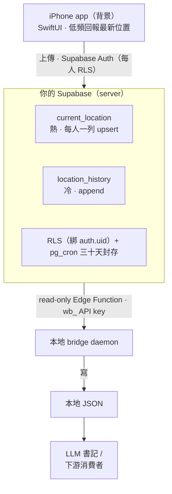

# 熊熊在哪裡 · wherebear —— 自己當那個偷看你行蹤的大公司

[](LICENSE)
[](https://swift.org/)
[](https://developer.apple.com/ios/)

[English](README.md)

大公司的位置時間軸其實挺貼心的：它默默記下你今天晃去哪、幾點到、待了多久，然後拿去做……嗯，你也不太確定拿去做了什麼。這個專案做的是同一件事，只差在那份「你今天去過哪」是存在**你自己的**後端、鑰匙在你手上。說白了就是「自己當那個偷看你行蹤的大公司」—— 只是這次大公司是你。

會做這個，是因為某天把第三方的位置歷史關掉之後才發現：「想知道自己昨天晃去哪」這個需求並沒有消失，我只是不想再用「把整條移動史交出去」來換而已。那就自己 host 一份吧。座標只進你自己的 Supabase，要給誰看、給哪個工具讀，你說了算。

<p align="center">
  
  
</p>

## 它在做什麼

- **手機端**：一支自寫的 native iOS app，在背景安安靜靜回報最新位置。**低頻、粗略、省電** —— 不是那種每秒鐘盯著你、順手把電池榨乾的連續追蹤（那個又侵入又燒電，也根本不是重點）。
- **後端**：你自己的 Supabase。位置存兩張表 —— 一張只記「現在在哪」（每次覆蓋，喜新厭舊）、一張記「去過哪」（一直累積，很念舊）。三十天後封存，但你想翻舊帳隨時調得回來。
- **本地 bridge**：一支常駐小程式，把最新座標拉下來寫成本地檔。誰想讀就讀 —— 你的工具、之後的地圖 app、朋友，或是一支負責碎念你在哪的 LLM 書記。

## 架構一眼（沒很複雜，別緊張）



兩條信任邊界值得記一下：**手機寫入**走真正的每人登入 —— RLS 把每一列綁死在 `auth.uid()`，誰都讀不到、也寫不進別人的位置。**bridge 讀取**走一支唯讀 Edge Function、拿一把 hashed `wb_` API key 擋門，所以下游那個讀的人（比方一支 LLM 書記，負責碎念「他現在在哪」）拿得到最新座標，卻從頭到尾碰不到你的資料庫金鑰。整條鏈路裡，網路只發生在 bridge 這一格。

技術選型：native Swift（不繞跨平台框架的遠路）、Supabase-native（BaaS，DB/Auth/Realtime/RLS 全託管 —— 白話講，就是沒有一支 server 半夜掛掉要你爬起來救）。至於為什麼這樣選、我們是怎麼被現實說服的，見 [`docs/DESIGN.md`](docs/DESIGN.md)；介面契約見 [`docs/API_CONTRACT.md`](docs/API_CONTRACT.md)。

## 分期

- **Phase 1**（✅ 完成）：回報 + 雙表儲存 + 讀最新 + 伺服器端地名標註 + 三十天封存。
- **Phase 2**（✅ 完成）：把一堆點聚成「今天的行程輪廓」+ 一個 MapKit 時間軸 app。

完整規劃見 [`docs/ROADMAP.md`](docs/ROADMAP.md)；自架步驟見 [`docs/DEPLOYMENT.md`](docs/DEPLOYMENT.md)。

## 目錄

```
wherebear/
├── app/        iOS：SwiftUI（元件化 UI + 邏輯層）
├── supabase/   後端：migrations（雙表 + RLS + pg_cron）+ functions（Edge Functions）
├── bridge/     本地 daemon：拉 Supabase → 寫本地 JSON
└── docs/       DESIGN · ROADMAP · SECURITY · API_CONTRACT · DEPLOYMENT · TUNABLES · ARCHITECTURE
```

> **Security Notice.** 座標、金鑰一律不進 git —— repo 只放通用 code 跟佔位範本（`.example`），真實 key／URL 住在 gitignored 的 `.env` 跟 `Config.local.swift`。`service_role` 金鑰永遠不落地 client，只活在 Supabase function secrets。手機端每人各自登入（RLS 綁 `auth.uid()`）、bridge 端拿可撤銷的 hashed `wb_` API key 讀。外部服務：你自己的 Supabase 專案、以及做地名反查的 Nominatim。發現洞？開個 issue。

## 授權

[MIT](LICENSE)。
