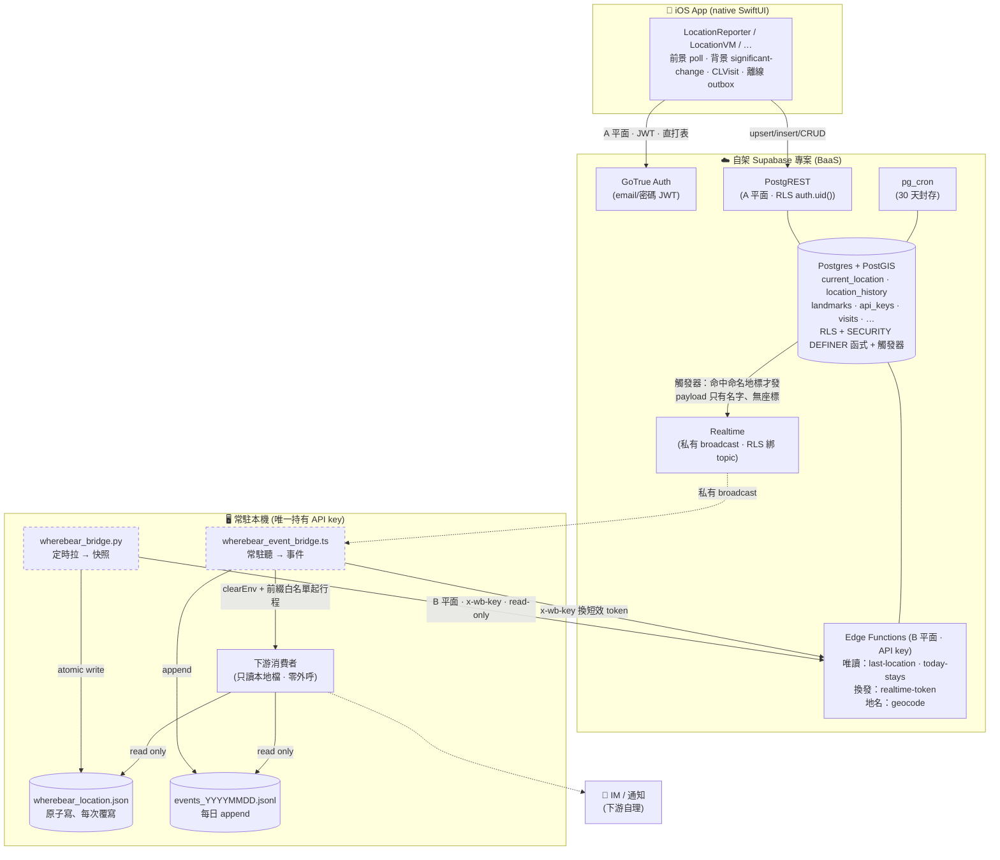
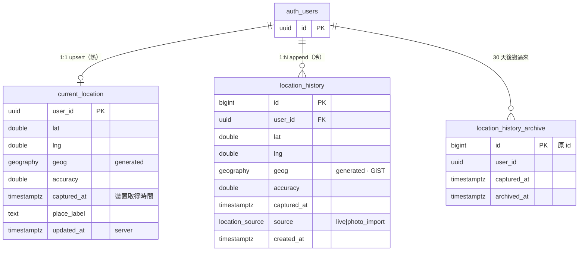
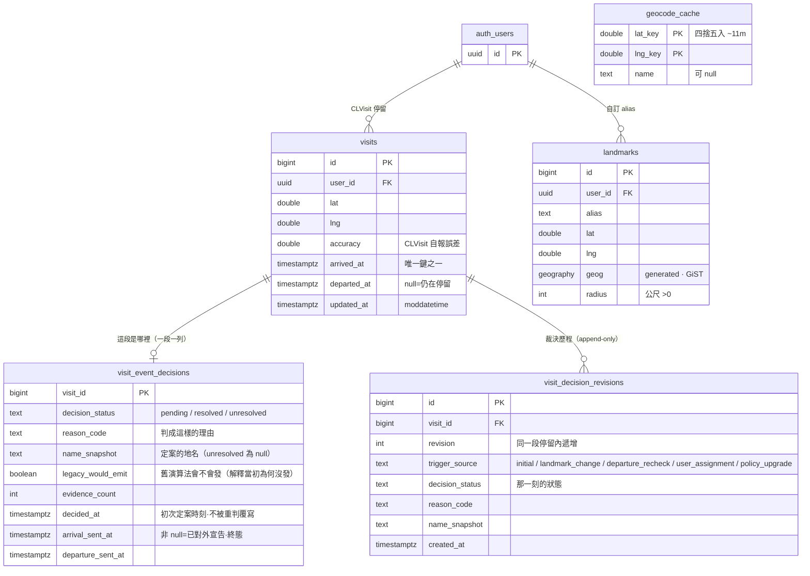
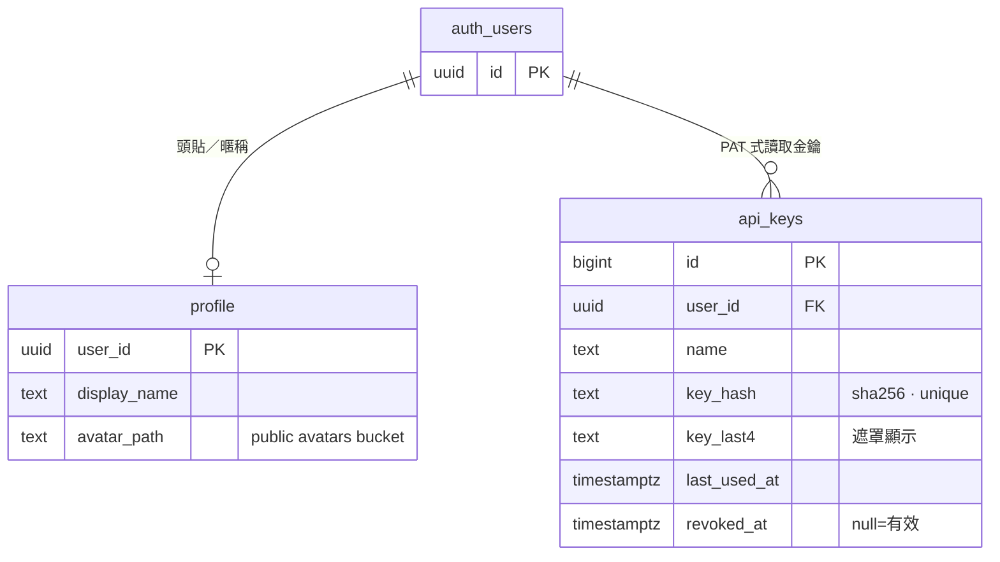
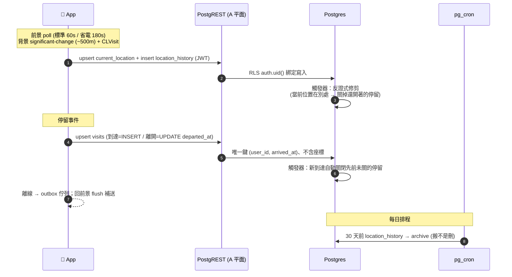
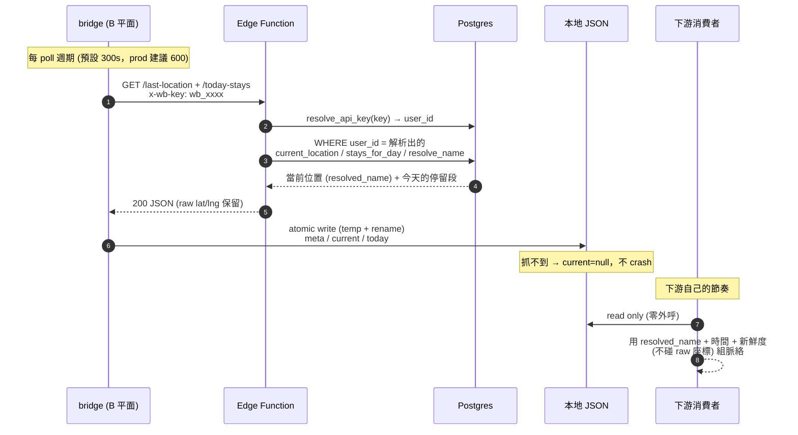
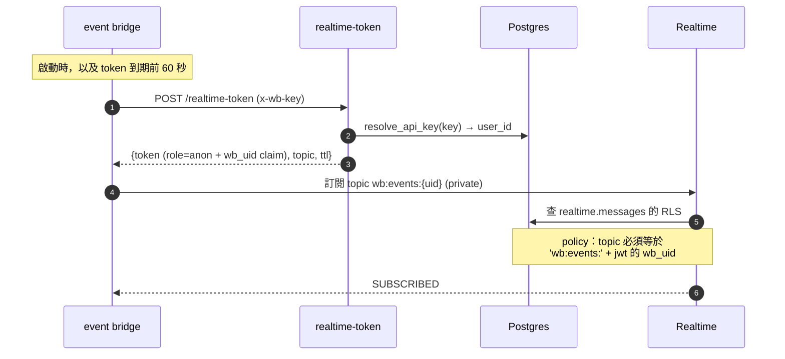
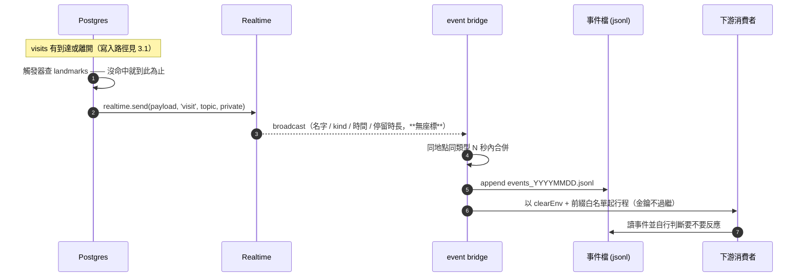
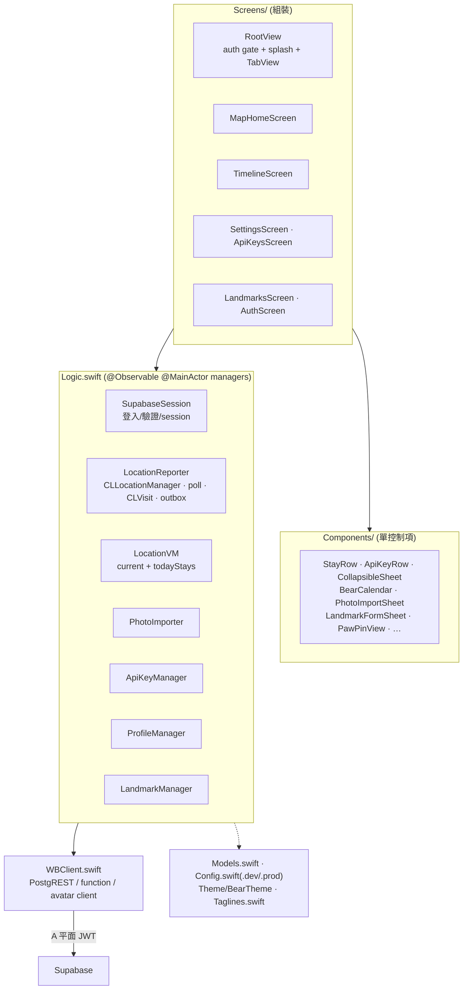

# ARCHITECTURE — kc_wherebear 系統架構

> **English summary:** A whole-system engineering overview of kc_wherebear — how a native iOS SwiftUI app reports location to a self-hosted Supabase backend, how a local bridge layer turns that into local files, and how a downstream consumer reads those files with no outbound calls of its own. Data reaches the consumer by two independent paths: a polled snapshot, and a pushed event stream for arrivals at / departures from user-named places (emitted by a database trigger, delivered over a private Realtime broadcast, and consumed by a long-running listener). It walks through the system diagram, the data model (split into three function-scoped ER diagrams), the end-to-end flows (write path, snapshot read path, and the two-part event path), the iOS app's layered architecture, and the deployment topology — nine mermaid diagrams in all. Interface values are not duplicated here — the contract lives in `API_CONTRACT.md`. The entity diagram now also covers the per-stay adjudication row and its append-only revision history.

> 全景工程文件：**手機回報位置 → 自架 Supabase → 本地 bridge → 下游消費者**的一條龍。
> 這份給「想快速看懂整個系統長怎樣」的人；**介面細節不在這** —— 契約看 [`API_CONTRACT.md`](API_CONTRACT.md)（SSOT）、設計理由看 [`DESIGN.md`](DESIGN.md) / [`DESIGN_app.md`](DESIGN_app.md)、可調參數看 [`TUNABLES.md`](TUNABLES.md)。這份只畫「元件怎麼接、資料怎麼流」，不複製契約值。
> 🔴 **born-clean**：本檔零真值（座標／金鑰／私域名稱全佔位）；下游消費者一律以通用「headless agent / bridge 消費者」稱之。

---

## 1. 系統總覽

自架個人位置平台。核心不變式：**網路只在 bridge 那一格**，下游消費者永遠只讀本地檔、零外呼。

後端對外只露**三支窄端點**：兩支唯讀（`last-location` / `today-stays`）＋一支換發（`realtime-token`，唯一會回傳憑證的端點）。資料到下游有**兩條路**——定時拉的快照，以及事件推播；兩條都在 bridge 那一格落地成本地檔。

> 圖上兩條虛線邊框的就是**唯一碰網路、唯一持金鑰**的那兩支。下游拿到的永遠是本地檔。

**兩個認證平面**（`API_CONTRACT §0`，別混）：

| 平面 | 誰用 | 認證 | 走什麼 | 授權 |
|---|---|---|---|---|
| **A. Owner** | app（寫入 + 管理 UI） | Supabase Auth **JWT** | **PostgREST** 直打資料表 | **RLS `auth.uid()`**（DB 內強制） |
| **B. Headless 讀** | bridge daemon | **API key**（`wb_` 前綴、`x-wb-key` header） | **Edge Function**（三支窄端點：兩讀＋一換發） | 函式內 `service_role` 繞 RLS → **自證 owner-scope**（解析 key→user_id、所有查詢綁該 id） |

紅線：`service_role` 只在 Edge Function secrets、永不進 client/repo/bridge；金鑰只是身分憑證、不攜權限（授權全在 RLS + 函式體）。

---

## 2. 資料模型（ER）

所有使用者表都以 `user_id` FK 綁 `auth.users(id)`、RLS `auth.uid()` 天生跨使用者隔離。座標一律**存 raw `lat`/`lng`**（契約要求保留），另生成 `geog geography(Point,4326)`（PostGIS 空間查詢用）。

分三張畫（一張全表的圖字會小到讀不動）：**位置與足跡**、**停留與命名**、**身分與存取**。三張共用同一個 `auth.users` 錨點。

### 2.1 位置與足跡（熱／冷／封存）

**熱/冷雙表**（`DESIGN D5`）：`current_location` 每人一列 upsert（讀最新 / 未來 Realtime 朋友即時）；`location_history` append（行程輪廓 + 停留偵測原料 + 封存）。分兩張不是為效能，是避免 Phase 3 開即時分享時對 live 資料動 schema 手術。

### 2.2 停留與命名

`visit_event_decisions` 是**每段停留一列**的當前狀態；`visit_decision_revisions` 是它的
append-only 歷程，舊列永不覆寫。兩者分開的理由：`decided_at` 與 `legacy_would_emit` 記的是
「當初為何這樣判」，而地標目錄會隨時間改變 —— 少了歷程，一段停留後來被重新命名之後，
就再也回答不了「它當初為什麼沒推播」。

`visits` 的唯一鍵是 `(user_id, arrived_at)`、**不含座標**（`DESIGN D14`：CLVisit 同一次停留投遞兩次且座標會漂）。`departed_at` 的收尾接受兩種證據（`DESIGN D15`），不是只等 CLVisit 給。

`geocode_cache` 刻意**不連 `auth.users`**：跨使用者共用、只存公開地名（見下方註）。

### 2.3 身分與存取

> `geocode_cache` **無 `user_id`**（跨使用者共用、只存公開地名）：RLS 開但零 policy、只 `service_role` 可存取。

**核心 SQL 函式**（皆 `SECURITY DEFINER`、`search_path=''`）：

| 函式 | 誰能呼叫 | 做什麼 |
|---|---|---|
| `resolve_api_key(presented)` | `service_role`（Edge Function） | key sha256 → `user_id` + bump `last_used_at`；未命中/已 revoke → 空 |
| `detect_stays(user, day, tz, radius=150, min_dwell=600, gap=1800)` | 內部 | 把 `location_history`（**只 `source=live`**）聚成停留段（半徑 150m / 最短停 10 分 / gap 30 分） |
| `photo_points(user, day, tz)` | 內部 | 相簿匯入點 → 個別點（`to=null`、`dwell=0`、`confidence=1`） |
| `visits_for_day(user, day, tz)` | 內部 | CLVisit 停留段（背景靜止、detect_stays 抓不到的久坐）。與當地日有交集就出、時間夾在當日邊界內（跨午夜在兩天各出一段）|
| `resolve_name(user, lat, lng[, slack_m])` | 內部 | **alias > `geocode_cache` > null**（owner-scope、不打外部 API）。`slack_m` 把 landmark 半徑放寬該座標自報的誤差（CLVisit 粗座標用）|
| `stays_for_day(user, day, tz)` | 內部 | **D14 合併**：CLVisit 段（時間為準）× live 聚合段（位置／名稱為準，重疊且 ≤150m 者配對）＋兩邊沒配對到的 ＋ 相簿匯入點 |
| `my_today_stays / my_stays_range / my_stays_days` | `authenticated`（`auth.uid()`） | app 平面：直接回 `stays_for_day` 的合併結果，各帶 `name`(resolve_name)+`source`。多日/區間版上限 31/32 天 |
| `my_recorded_days` | `authenticated` | 行事曆用：哪些天有資料 |
| `visit_event_broadcast()` | 觸發器（`visits` INSERT／`departed_at` UPDATE） | 解析地標，**命中才** `realtime.send()` 私有 broadcast。payload 只帶名字、不帶座標 |
| `visits_autoclose_stale()` | 觸發器（`visits` BEFORE INSERT） | 新到達進來 → 關掉先前仍未關的停留（人不可能同時在兩地）。只關 `arrived_at` 更早的，防亂序補傳 |
| `visits_close_on_departure_evidence()` | 觸發器（`current_location` 寫入） | 反證式修剪：當前位置持續在別處且逾 15 分鐘 → 關在「最後一次還在附近」的時刻（`DESIGN D15`）|

> **headless `/today-stays` 回 `stays_for_day` 的合併結果**（`visit` ＋ `live`），但**濾掉 `photo_import`** —— 下游只吃「面」的契約穩定（D14 前只回 `detect_stays`，久坐長停留在下游會縮成碎片）。

---

## 3. 端到端資料流

一趟完整的路分三段畫（每張只放該段真正參與的角色，圖才讀得動）：

| 段 | 誰跟誰 | 回答的問題 |
|---|---|---|
| **3.1 寫入** | 手機 → 後端 | 位置怎麼進到資料庫 |
| **3.2 快照讀取** | 後端 → bridge → 下游 | 「他現在在哪、今天去過哪」 |
| **3.3 事件推播** | 資料庫 → listener → 下游 | 「他**剛剛**到了／離開了某個命名地點」（再拆 3.3a 建訂閱 / 3.3b 事件流）|

3.2 與 3.3 是**兩條獨立的路**，並行、不互相取代：一條是下游自己按節奏讀最新狀態，一條是事件來了把下游叫醒。

### 3.1 寫入路徑（手機 → 後端）

省電設計：手機**低頻**回報，靜止也寫（那是停留偵測的原料）。

> 兩個觸發器都是為了同一件事：**停留段一定要關得掉**。CLVisit 的離開投遞會遺失、也會對短距離移動不發新到達（`DESIGN D15`）。

### 3.2 快照讀取路徑（後端 → 下游）

下游永遠只讀本地檔；網路只發生在 bridge 那一格。

**新鮮度 / hedge**（`API_CONTRACT §6`）：下游用 `meta.fetched_at`（bridge 抓取時間）+ `current.captured_at`（裝置取得時間）各自判過時、對舊資料措辭保守；`current=null` = bridge 這輪抓不到，下游不當「人在 null-island」。`schema_version` 供未來相容演進。

**地名解析**（`API_CONTRACT §3`）：座標 → 名稱固定優先序 **① 使用者 alias（落 landmark radius 內）② `geocode_cache` 快取地名 ③ 通用 reverse-geocode（`geocode` Edge Function → Nominatim，read-through 存快取）④ null**。命中 alias/快取就免打外部 API。快取鍵＝座標四捨五入 4 位（app/function/SQL 一致）。

> 🔴 改 `_shared/` 底下的地名邏輯要**重新部署所有引用它的 function** —— Edge Function 在部署當下才打包 `_shared`。而且 `geocode_cache` 不會自己更新，改標籤格式要一併清舊快取。

### 3.3 事件推播路徑（資料庫 → listener → 下游）

只有**到達／離開使用者自己命名過的地點**才會產生事件；未命名的地方完全靜默。分兩張：先把訂閱建起來，再看事件怎麼流。

#### 3.3a 建立訂閱（listener 怎麼取得身分）

**為什麼要換發**：`wb_` key 是自家發明的，只有自家 Edge Function 認得；Realtime 是平台服務、只認 JWT。這一步就是那道翻譯。

**為什麼這張 token 幾乎什麼都不能做**（`DESIGN D13`）：`role=anon` 是**權限等級**（該角色在 `public` schema 一無所有），`wb_uid` 是**身分標籤**（policy 拿它綁 topic）。兩者拆開，才做得到「能收自己的事件、除此之外什麼都不能做」。若改成訂閱 `visits` 表，就需要一把看得見該表的 JWT，而同一把對 PostgREST 一樣有效 → 消費端權限會膨脹成整個帳號。

#### 3.3b 事件發生到下游

**新鮮度陷阱**：離線佇列補傳會把幾小時前的到達寫進資料庫，觸發器照發 —— 所以事件的新鮮度要看 `arrived_at`／`departed_at`，**不能看收到的時間**。

---

## 4. App 架構（iOS SwiftUI）

分層：**Screens（組裝）· Components（單控制項）· Logic（`@Observable @MainActor` managers）· WBClient（後端 client）· Models/Config/Theme**。UI/視覺由 前端層 生、功能/狀態由 brief（`DESIGN_app.md`）定、邏輯層 repo 實作。

**回報策略**（`LocationReporter`，細節 `TUNABLES.md`）：

- **前景 poll**（標準 60s / 省電 180s）：**靜止也寫**（停留偵測的原料）。
- **背景**：significant-change（~500m）+ **CLVisit**（久坐靜止 → `visits`，補 detect_stays 抓不到的）。
- **離線 outbox**：寫失敗本地佇列、回前景 flush 補送。
- **顯示即時流**（地圖用 `distanceFilter=10m`）：只更新畫面、**不寫 DB**（抗抖）。

登入後 `RootView` gate → `MainTabView`（地圖／時間軸／設定，iOS 26 原生 Liquid Glass tab bar）；啟動 splash 沿用 `LaunchImage` + 皮克敏式斜紋進度條 + 隨機氛圍小字（詞庫 `Taglines.local.json` gitignore、公開版用 sample）。

---

## 5. 部署拓撲與紀律

- **後端**：自架 Supabase 專案（`supabase/` migrations + Edge Functions；`DESIGN A vs B` 選 Supabase-native）。本地開發用丟棄式 `supabase start` 驗 RLS/端到端。
- **bridge（兩支，同一份 `.env`、同一把 API key，但 launchd 型態相反）**：

  | | `wherebear_bridge.py` | `wherebear_event_bridge.ts` |
  |---|---|---|
  | 型態 | `StartInterval` 定時叫醒、跑完就結束 | `KeepAlive` 常駐、掛了自動拉起 |
  | 相依 | 純標準函式庫 | Deno ＋ `npm:@supabase/supabase-js`（相依寫在 import 行、首次執行自動快取，更新仍是複製一個檔） |
  | 產出 | 覆寫式快照 JSON | 每日 append 的事件檔 |

  `API_CONTRACT §6`（快照）與 `§6.5`（事件）是它們與下游的消費契約 SSOT。
- **下游消費者**：只讀 bridge 產的本地檔，外部能力橋接邊界見下游自己的 ADR。呼叫它的環境走前綴白名單，金鑰不過繼。
- **born-clean**（`DESIGN D10`）：獨立可開源、無 git-crypt、靠衛生紀律不靠加密；真座標/金鑰走 `Config.local.swift` / bridge env、不進 repo；push 前 gitleaks 掃。
- **Phase 3 分享**（`shares` 表 + 跨使用者 RLS + Realtime）不在本版，屆時另開安全審查（`ROADMAP.md`）。

---

## 交叉引用

| 想知道 | 看 |
|---|---|
| endpoint / payload / 錯誤形狀 / bridge JSON schema（SSOT） | [`API_CONTRACT.md`](API_CONTRACT.md) |
| 後端設計理由（D1–D15、熱/冷雙表、A vs B） | [`DESIGN.md`](DESIGN.md) |
| app 畫面規格 / 邏輯層契約（給 前端層） | [`DESIGN_app.md`](DESIGN_app.md) |
| 可調參數（半徑/門檻/poll 週期/distanceFilter） | [`TUNABLES.md`](TUNABLES.md) |
| 分期上線規劃 | [`ROADMAP.md`](ROADMAP.md) |
