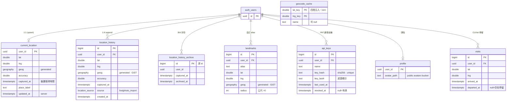
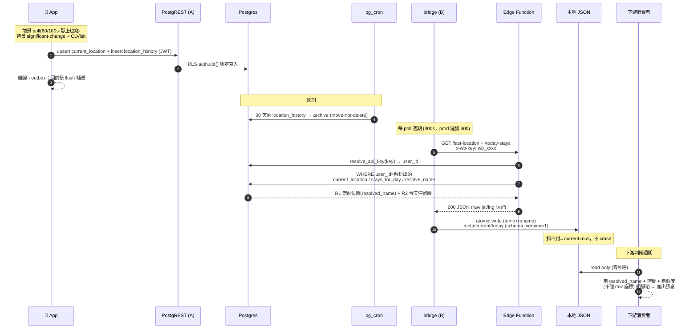
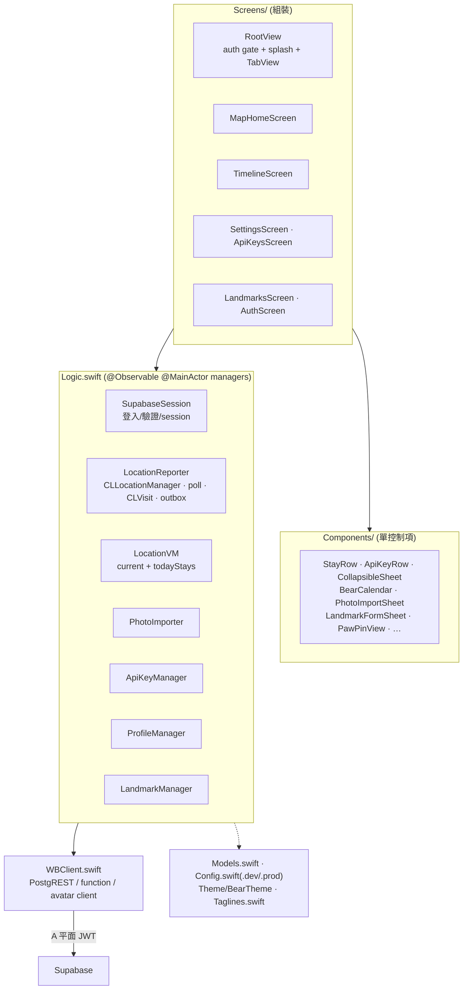

# ARCHITECTURE — kc_wherebear 系統架構

> **English summary:** A whole-system engineering overview of kc_wherebear — how a native iOS SwiftUI app reports location to a self-hosted Supabase backend, a local bridge daemon caches the latest data into a local JSON file, and a downstream headless agent reads that file with no outbound calls of its own. It walks through the system diagram, the entity-relationship data model, the end-to-end data flow, and the iOS app's layered architecture, illustrated with four mermaid diagrams. Interface values are not duplicated here — the contract lives in `API_CONTRACT.md`.

> 全景工程文件：**手機回報位置 → 自架 Supabase → 本地 bridge → 下游 headless agent**的一條龍。
> 這份給「想快速看懂整個系統長怎樣」的人；**介面細節不在這** —— 契約看 [`API_CONTRACT.md`](API_CONTRACT.md)（SSOT）、設計理由看 [`DESIGN.md`](DESIGN.md) / [`DESIGN_app.md`](DESIGN_app.md)、可調參數看 [`TUNABLES.md`](TUNABLES.md)。這份只畫「元件怎麼接、資料怎麼流」，不複製契約值。
> 🔴 **born-clean**：本檔零真值（座標／金鑰／私域名稱全佔位）；下游消費者一律以通用「headless agent / bridge 消費者」稱之。

---

## 1. 系統總覽

自架個人位置平台。核心不變式：**網路只在 bridge 那一格**，下游消費者永遠只讀本地檔、零外呼；後端對外只露**兩個窄讀口**。

```mermaid
flowchart TB
    subgraph device["📱 iOS App (native SwiftUI)"]
        app["LocationReporter / LocationVM / …<br/>前景 poll · 背景 significant-change · CLVisit · 離線 outbox"]
    end

    subgraph supabase["☁️ 自架 Supabase 專案 (BaaS)"]
        auth["GoTrue Auth<br/>(email/密碼 JWT)"]
        rest["PostgREST<br/>(A 平面 · RLS auth.uid())"]
        edge["Edge Functions<br/>(B 平面 · API key 窄讀口)<br/>last-location · today-stays · geocode"]
        db[("Postgres + PostGIS<br/>current_location · location_history<br/>landmarks · api_keys · visits · …<br/>RLS + SECURITY DEFINER 函式")]
        cron["pg_cron<br/>(30 天封存)"]
    end

    subgraph local["🖥️ 常駐本機"]
        bridge["bridge daemon<br/>(stdlib Python · 唯一持有 API key)"]
        json[("wherebear_location.json<br/>本地原子寫檔")]
        agent["下游 headless agent<br/>(只讀本地檔 · 零外呼)"]
    end

    im["📨 IM / 通知<br/>(下游自理)"]

    app -- "A 平面 · JWT · 直打表" --> auth
    app -- "upsert/insert/CRUD" --> rest
    rest --- db
    edge --- db
    cron --- db
    bridge -- "B 平面 · x-wb-key · read-only" --> edge
    bridge -- "atomic write" --> json
    agent -- "read only" --> json
    agent -.-> im

    classDef net stroke-dasharray:5 5;
    class bridge net;
```

**兩個認證平面**（`API_CONTRACT §0`，別混）：

| 平面 | 誰用 | 認證 | 走什麼 | 授權 |
|---|---|---|---|---|
| **A. Owner** | app（寫入 + 管理 UI） | Supabase Auth **JWT** | **PostgREST** 直打資料表 | **RLS `auth.uid()`**（DB 內強制） |
| **B. Headless 讀** | bridge daemon | **API key**（`wb_` 前綴、`x-wb-key` header） | **Edge Function**（唯二窄讀口） | 函式內 `service_role` 繞 RLS → **自證 owner-scope**（解析 key→user_id、所有查詢綁該 id） |

紅線：`service_role` 只在 Edge Function secrets、永不進 client/repo/bridge；金鑰只是身分憑證、不攜權限（授權全在 RLS + 函式體）。

---

## 2. 資料模型（ER）

所有使用者表都以 `user_id` FK 綁 `auth.users(id)`、RLS `auth.uid()` 天生跨使用者隔離。座標一律**存 raw `lat`/`lng`**（契約要求保留），另生成 `geog geography(Point,4326)`（PostGIS 空間查詢用）。

> `geocode_cache` **無 `user_id`**（跨使用者共用、只存公開地名）：RLS 開但零 policy、只 `service_role` 可存取。

**熱/冷雙表**（`DESIGN D5`）：`current_location` 每人一列 upsert（讀最新 / 未來可加 Realtime）；`location_history` append（行程輪廓 + 停留偵測原料 + 封存）。分兩張不是為效能，是避免日後加即時功能時對 live 資料動 schema 手術。

**核心 SQL 函式**（皆 `SECURITY DEFINER`、`search_path=''`）：

| 函式 | 誰能呼叫 | 做什麼 |
|---|---|---|
| `resolve_api_key(presented)` | `service_role`（Edge Function） | key sha256 → `user_id` + bump `last_used_at`；未命中/已 revoke → 空 |
| `detect_stays(user, day, tz, radius=150, min_dwell=600, gap=1800)` | 內部 | 把 `location_history`（**只 `source=live`**）聚成停留段（半徑 150m / 最短停 10 分 / gap 30 分） |
| `photo_points(user, day, tz)` | 內部 | 相簿匯入點 → 個別點（`to=null`、`dwell=0`、`confidence=1`） |
| `visits_for_day(user, day, tz)` | 內部 | CLVisit 停留段（背景靜止、detect_stays 抓不到的久坐）。與當地日有交集就出、時間夾在當日邊界內（跨午夜在兩天各出一段）|
| `resolve_name(user, lat, lng[, slack_m])` | 內部 | **alias > `geocode_cache` > null**（owner-scope、不打外部 API）。`slack_m` 把 landmark 半徑放寬該座標自報的誤差（CLVisit 粗座標用）|
| `stays_for_day(user, day, tz)` | 內部 | **D14 合併**：CLVisit 段（時間為準）× live 聚合段（位置／名稱為準，重疊且 ≤150m 者配對）＋兩邊沒配對到的 ＋ 相簿匯入點 |
| `my_today_stays / my_stays_range / my_stays_days` | `authenticated`（`auth.uid()`） | app 平面：直接回 `stays_for_day` 的合併結果，各帶 `name`(resolve_name)+`source`。多日/區間版上限 31/32 天 |
| `my_recorded_days` | `authenticated` | 行事曆用：哪些天有資料 |

> **headless `/today-stays` 回 `stays_for_day` 的合併結果**（`visit` ＋ `live`），但**濾掉 `photo_import`** —— 下游只吃「面」的契約穩定（D14 前只回 `detect_stays`，久坐長停留在下游會縮成碎片）。

---

## 3. 端到端資料流

「手機回報 → 下游消費者 拉下來用」的完整一趟。省電設計：手機**低頻**回報、後端聚類成「面」、bridge 週期性快取成本地檔。

**新鮮度 / hedge**（`API_CONTRACT §6`）：下游用 `meta.fetched_at`（bridge 抓取時間）+ `current.captured_at`（裝置取得時間）各自判過時、對舊資料措辭保守；`current=null` = bridge 這輪抓不到，下游不當「人在 null-island」。`schema_version` 供未來相容演進。

**地名解析**（`API_CONTRACT §3`）：座標 → 名稱固定優先序 **① 使用者 alias（落 landmark radius 內）② `geocode_cache` 快取地名 ③ 通用 reverse-geocode（`geocode` Edge Function → Nominatim，read-through 存快取）④ null**。命中 alias/快取就免打外部 API。快取鍵＝座標四捨五入 4 位（app/function/SQL 一致）。

---

## 4. App 架構（iOS SwiftUI）

分層：**Screens（組裝）· Components（單控制項）· Logic（`@Observable @MainActor` managers）· WBClient（後端 client）· Models/Config/Theme**。UI/視覺由 前端層 生、功能/狀態由 brief（`DESIGN_app.md`）定、邏輯層 repo 實作。

**回報策略**（`LocationReporter`，細節 `TUNABLES.md`）：

- **前景 poll**（標準 60s / 省電 180s）：**靜止也寫**（停留偵測的原料）。
- **背景**：significant-change（~500m）+ **CLVisit**（久坐靜止 → `visits`，補 detect_stays 抓不到的）。
- **離線 outbox**：寫失敗本地佇列、回前景 flush 補送。
- **顯示即時流**（地圖用 `distanceFilter=10m`）：只更新畫面、**不寫 DB**（抗抖）。

登入後 `RootView` gate → `MainTabView`（地圖／時間軸／設定，iOS 26 原生 Liquid Glass tab bar）；啟動 splash 沿用 `LaunchImage` + 皮克敏式斜紋進度條 + 隨機氛圍小字（詞庫 `Taglines.local.json` gitignore、公開版用 sample）。

---

## 5. 部署拓撲與紀律

- **後端**：自架 Supabase 專案（`supabase/` migrations + Edge Functions；`DESIGN A vs B` 選 Supabase-native）。本地開發用丟棄式 `supabase start` 驗 RLS/端到端。
- **bridge**：本地機器常駐（stdlib Python，唯一持 API key）；`API_CONTRACT §6` 是它與下游的消費契約 SSOT。
- **下游消費者**：只讀 bridge 產的本地 JSON，外部能力橋接邊界見下游自己的 ADR。
- **born-clean**（`DESIGN D10`）：獨立可開源、無 git-crypt、靠衛生紀律不靠加密；真座標/金鑰走 `Config.local.swift` / bridge env、不進 repo；push 前 gitleaks 掃。

---

## 交叉引用

| 想知道 | 看 |
|---|---|
| endpoint / payload / 錯誤形狀 / bridge JSON schema（SSOT） | [`API_CONTRACT.md`](API_CONTRACT.md) |
| 後端設計理由（D1–D12、熱/冷雙表、A vs B） | [`DESIGN.md`](DESIGN.md) |
| app 畫面規格 / 邏輯層契約（給 前端層） | [`DESIGN_app.md`](DESIGN_app.md) |
| 可調參數（半徑/門檻/poll 週期/distanceFilter） | [`TUNABLES.md`](TUNABLES.md) |
| 分期上線規劃 | [`ROADMAP.md`](ROADMAP.md) |
