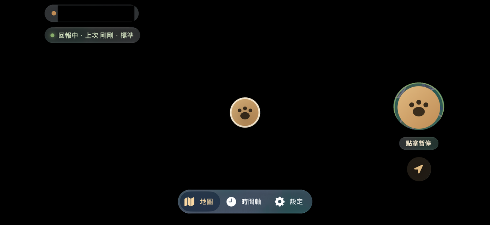
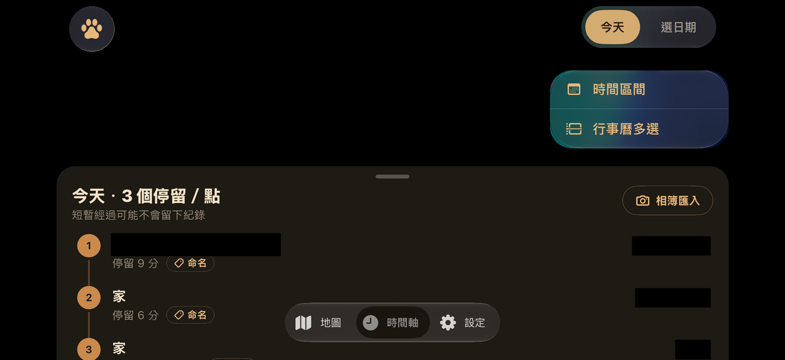
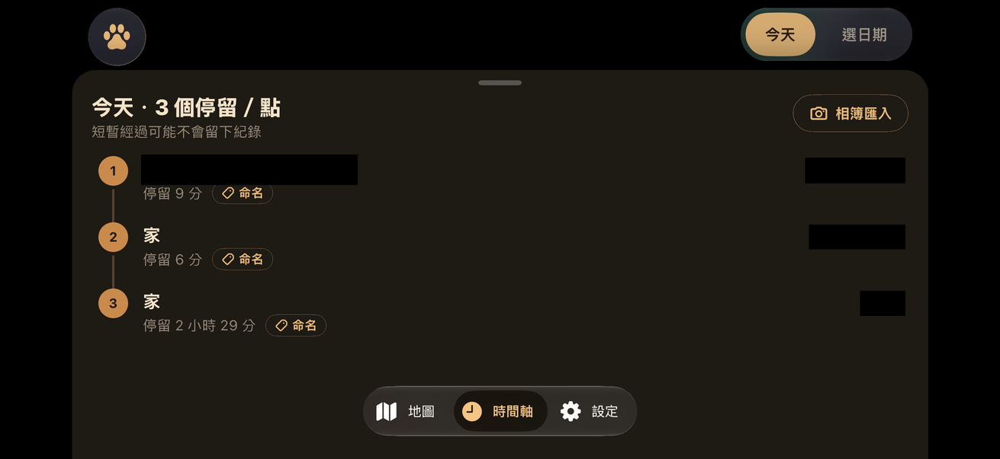

# iPhone Duo 適配筆記

> **English summary:** How wherebear's SwiftUI screens were adapted for iPhone Duo's folding display and for multi-app Split View on its inner screen. It records the seven window shapes the app can encounter (closed portrait/landscape, unfolded flat portrait/landscape, half-folded book and laptop postures), the three layout rules those collapse into, and what each screen — map home, timeline, settings — does in each. The layout reads the system's `reservedRegions` for hinge divisions and camera occlusions rather than guessing from screen-centre constants or hinge angle, and it deliberately distinguishes "background may extend here" from "the user may tap here". It also keeps the pre-work research and the proposals that were considered and dropped, so the reasoning behind the final shape is recoverable. **All of this was verified in Simulator and in unit-level geometry checks only — see the hardware caveat below.**

> 範疇：**只動畫面層**。回報、資料、Supabase、bridge 都不碰；唯一的例外見〔時間軸框景〕。
> 踩坑、修法與驗證範圍見 [適配回顧](IPHONE_DUO_LESSONS.md)。

## 🔴 尚未在實機上驗證過

**這份適配到目前為止，沒有在任何一台實體 iPhone Duo 上跑過。** 全部證據只有三種：

| 證據 | 涵蓋什麼 | 不涵蓋什麼 |
|---|---|---|
| Duo Simulator 操作 | 七種形狀的版面、旋轉、Split View 左右位置的展開與折疊 | 實機的安全區、鉸鏈事件時序、真實觸控 |
| 純 Swift 幾何檢查 | 摺痕、鏡頭遮擋、導覽列換邊、抽屜間距的數學 | SwiftUI 實際渲染有沒有裁切 |
| SwiftUI hosting 測試 | 日期卡片共用容器的十二種尺寸組合 | 完整的日期、匯入與姿態切換互動 |

裝置 2026-10-23 才上市。**如果你手上已經有一台，歡迎開 issue 或 PR 回報。**
最有價值的幾件事：

1. 實機的 `reservedRegions` 回傳值跟 Simulator 對不對得起來，特別是半摺書本式與筆電式的 `frame` 與 `isActive`。
2. 旋轉到鏡頭在下角時，闔上首頁的操作鍵有沒有真的換到導覽列的另一側。
3. 多 App Split View 折疊的瞬間，地圖有沒有被搶走縮放或重新框景。
4. 時間軸抽屜全開時旋轉，清單最後一筆還看不看得到。

回報時附上目前 View 的尺寸、safe area、size class、reserved region 的 `frame` 與 `isActive`、
導覽列側邊，以及最後選出的版面模式，這幾項就足夠分辨是系統給的輸入變了，還是 app 解讀錯了。
[適配回顧](IPHONE_DUO_LESSONS.md)最後一節有完整的回歸清單。

## 實作範圍

### 多 App Split View

- 左右窄視窗的可用內容實測皆為 385 × 635 點。折疊不改變視窗尺寸，但會啟用靠邊的 division。原判斷只看相交，導致左列表或右地圖寬度變成零。這與單一 App 內部的書本式分欄不同。
- `reservedRegions` 的 `frame` 已包含 margins，直接使用目前 View 的座標，不再重複擴張。只有橫跨內容、且兩側各至少 120 點的保留區才分欄；邊緣與細條區域只讓前景避讓，地圖背景保留原視窗。
- 窄視窗使用 `compactOverlay`，不把它解讀為實體外螢幕。左右 Split View 在折疊前後皆保留首頁控制組、時間軸浮動抽屜與日期容器；左側 App 的資訊及工具列靠右，右側 App 靠左，尊重系統側欄安全區。
- 邊緣保留區啟用／停用不觸發地圖重新框景。未改變視窗尺寸或分欄模式時，維持縮放、選取、抽屜段位與捲動狀態；真正的內部分欄和視窗縮放仍重新配置地圖。
- 純 Swift 回歸先以實測左右資料重現失敗，再檢查邊緣、微小側欄、區域超出視窗、部分相交及框景判斷；原有 378 組內部分欄、手機、旋轉與抽屜間距測試仍通過。日期 hosting 測試加入折疊前後可用寬度，共 12 種組合通過。

### 單一 App

- 闔上首頁：隱藏大頭貼，回報熊掌與定位切換為下方水平控制組，位於側邊導覽列的另一側；兩顆圓鈕等高並各帶文字狀態。上方鏡頭可微調頂部間距，下方鏡頭不再推動頂部位置卡與時間軸按鈕。
- 展開首頁：大頭貼移到位置狀態組左側；資訊固定在整個畫面左上，筆電式也不移到下半部；回報／定位控制統一靠左下，避開摺痕與導覽列。直向內螢幕左上資訊不重複疊加整條頂部安全區留白，地圖背景保持滿版。
- 闔上時間軸：採用有左右與底部邊距、四角圓角的三段式浮動抽屜。
- 攤平橫向：左側約三分之一清單、右側地圖；可收合清單，地圖保留展開入口。
- 半開書本式：左清單、右地圖，分界依系統摺痕保留區 frame（已含 margins），不以螢幕中央常數猜測。
- 半開筆電式：上地圖、下固定時間軸。日期、數量與匯入入口在下面；沒有面板拖曳把手，清單仍可捲動。
- 分欄時間軸將帳號大頭貼、日期與相機匯入按鈕放在同一列；空間不足才換行。攤平橫向第一排為大頭貼、日期與收合入口，第二排為熊掌與相機，避免大頭貼獨占一排。框景保留熊掌圖示「顯示全部足跡」，與日期、相機集中在同一組操作列，熊掌與相機使用不透明深色底；清單收合時，地圖仍保留框景與展開入口。
- 筆電式操作列只有日期與相機，放下半部；展開直向與闔上時間軸的相機入口緊接日期。一般手機維持原匯入文字按鈕。
- 日期對話框限制於清單所在分區；切換姿態保留日期、選取停留點與捲動狀態。
- 筆電式月曆採左月曆、右快捷日期與固定完成／取消；只有下方清單加遮罩，上方地圖保持清楚。月曆可獨立捲動。遮罩覆蓋摺痕中央至底邊，互動內容仍使用安全分區。
- 書本與筆電式清單的時間維持在地名右側；僅窄側欄與闔上抽屜使用緊湊換行。
- 書本半開與攤平橫向的日期遮罩僅覆蓋左側清單，右側地圖保持清楚。
- 攤平直向保留抽屜。一般手機維持原版面。設定頁僅調整側邊導覽列模式的捲動尾端留白。相簿匯入在清單分區內呈現，不跨進地圖；筆電式寬度足夠時，左側放說明與時間範圍，右側放掃描結果與固定匯入／取消按鈕，窄版維持上下排列。
- 多視窗保持啟用。此次不新增方向鎖定；早期提出的外螢幕鎖直向方案未採用，最終支援 iPhone 四個方向。

### 日期對話框與匯入面板

- 時間區間與多選月曆共用 `AdaptiveDateDialog`，在目前可用區域置中；分欄時仍限制於清單分區，避開導覽列與摺痕。
- 時間區間使用同一張卡片的「從／到」切換欄位與內嵌日曆，不再疊第二層日期 popover。原本的日期套用方式與天數上限保留。
- 短而寬的視窗採左日曆、右操作區；直向採上下排列。內容可容納時依內容高度置中，放不下時捲動內容，取消／完成固定可見。
- 相簿匯入的原生 sheet 改為量測內容高度，選擇自訂日期或出現結果訊息時跟著調整；分欄內嵌匯入維持既有容器。

### 旋轉

- 重現：外螢幕相機孔移到下角時，舊計算會把上方控制列移到下方，與首頁操作鍵或時間軸抽屜重疊。現在只在闔上模式限制頂部間距；展開分區與既有控制組對齊不變。
- 使用目前視窗的 `toolbarVerticalEdge` 判斷導覽列左右，闔上首頁操作鍵放在另一側；不快取裝置方向或依上一個姿態猜測。
- 闔上時間軸量測工具列與選取卡的實際高度，抽屜上緣至少保留 12 點間距；短視窗的三段位置保持有序，旋轉時清除尚未結束的拖曳位移。
- 設定頁在側邊導覽列模式取消額外 100 點底部預留，保留一般內容邊距；底部分頁列模式維持原間距。
- iPhone 方向宣告補上倒置直向；沒有加入方向鎖定。建置產物已檢查包含四個方向。

### 實作骨架

`AdaptiveMapLayout` 透過 iOS 27.1 `GeometryProxy.reservedRegions` 取得 division 與 occlusion，
以同一組幾何區域配置地圖、面板與浮層。保留舊系統的安全區域版面。
分欄地圖取消原本為底部抽屜補償的向南偏移。清單收合只限攤平橫向。

## 先知道的事實

| 項目 | 內容 |
|---|---|
| 上市 | 2026-10-23，出廠搭載 iOS 27.1 |
| 開發工具 | **Xcode 27.1 beta**（27A9269），含 iOS 27.1 SDK 與 Duo Simulator；需 macOS Tahoe 26.6 以上 |
| 別裝錯 | Xcode 27.2 beta 的 release notes 另外指向一個下載點取得 Duo 的 SDK 與 Simulator，看起來 27.2 beta 本身不含 |
| 內螢幕 | 7.6 吋，1878 × 2670，打開後自然方向是**橫的**（約 1.42 : 1，接近 A4 橫放），摺痕是中間那條直線 |
| 外螢幕 | 5.4 吋，1398 × 2034，比一般 iPhone **矮胖** |
| size class | 外螢幕是窄的（compact 寬）；內螢幕寬、高都是 regular，跟 iPad 同一級 |
| 控制列 | 外螢幕，以及內螢幕橫拿時，分頁列和工具列會移到**側邊直排**，並且**對齊鏡頭那一側的硬體**，正常拿法下在**右邊**。內螢幕直向時維持上下橫排 |

Simulator 已知限制：第一次啟動要好幾分鐘；沒有 StandBy；大部分 app extension 不能在上面跑或除錯。

## 七種畫面形狀與取捨

官方給的是四個動作（打開、闔上、旋轉、半摺），組合起來 wherebear 會遇到下面這些形狀：

| # | 狀態 | 畫面形狀 | 摺痕 | 處理 |
|---|---|---|---|---|
| 1 | 闔上直拿 | 外螢幕，矮胖直立 | 無 | 維持手機版 🔴 必須好看 |
| 2 | 闔上橫拿 | 外螢幕橫放，非常扁 | 無 | 原提案鎖直向；最終改為支援左右橫向，操作列、抽屜與日期卡片適應短視窗 |
| 3 | 打開攤平、橫拿 | 寬比高多 | 有，但攤平時不影響 | 左清單、右地圖 🔴 必須好看 |
| 4 | 打開攤平、轉直 | 高比寬多，像小 iPad | 有，但攤平時不影響 | 現在的底部抽屜照用 |
| 5 | 半摺拿在手上（書本式） | 左右兩半 | 直的一條 | 左清單、右地圖，順著摺痕切 |
| 6 | 半摺立在桌上（筆電式） | 上半立起、下半平躺 | 橫的一條 | 上地圖（給人看）、下清單和按鈕（給人按） |
| 7 | 半摺像書一樣立在桌上 | 同 5 | 直的一條 | 同 5 |

分級的理由：日常會用到的是 1 和 3，這兩種要真的好看；其他幾種只要做到「熊掌不掉進摺縫、面板不橫跨摺痕、東西不被切掉」。

HIG 明講**不要每個姿勢各做一版**，所以上表收斂成三條規則。

## 三條規則

**規則一：寬度窄（1、2）→ 保留地圖加抽屜。** 系統可能把分頁列搬到側邊，實際左右位置讀取目前視窗的環境值。

**規則二：寬度夠、沒摺痕（3、4）→ 看畫面是寬還是高。** 寬的話清單放在左側、固定寬度；高的話沿用底部抽屜。

**規則三：有摺痕（5、6、7）→ 順著摺痕切兩半。** 摺痕是直的就左清單、右地圖；摺痕是橫的就上地圖、下清單。

時間軸在各形狀下的樣子（`▕控▏` 代表系統放在右側的直排控制列）：

```
 1 闔上直拿                   3 攤平橫拿
┌─────────┬─┐               ┌───────────┬──────────────┬─┐
│  地 圖   │控│               │ 足跡清單    │              │控│
│   🐾    │  │               │ ① 00:08   │    地 圖      │  │
├─────────┤  │               │ ② 01:29   │     🐾       │  │
│ 足跡抽屜  │  │               │ （固定寬度）│              │  │
└─────────┴─┘               └───────────┴──────────────┴─┘

 5 / 7 半摺書本式                        6 立在桌上（筆電式）
┌───────────┬┆┬──────────┬─┐          ┌──────────────┐ ← 立起來的上半
│ 足跡清單    │┆│          │控│          │    地 圖      │   給人「看」
│ ① 00:08   │┆│   地 圖   │  │          │     🐾       │
│ ② 01:29   │┆│    🐾    │  │          ├┄┄┄┄┄┄┄┄┄┄┄┄┄┄┤ ← 摺痕
│           │┆│          │  │          │ 足跡清單＋按鈕  │ ← 平躺的下半
└───────────┴┆┴──────────┴─┘          │ 地圖 時間 設定  │   給人「按」
                                       └──────────────┘
```

清單放左邊，是因為右邊已經被系統控制列占住（參考其他通訊類 app 在 Duo 上的版面：左側清單、右側內容、控制列貼右緣）。

## 各畫面要改什麼

### 時間軸（改動最多）

- 寬版（3、5、7）：`CollapsibleSheet` 換成左側固定寬度的面板，地圖只占右邊；窄版（1、4）照舊用 `CollapsibleSheet`。用 size class 在兩種容器間切換，**清單內容本身不用改**
- 筆電式（6）：上地圖、下清單
- Apple 有現成容器 `ArrangementView`，文件描述的行為跟規則三幾乎一樣（沒摺痕時疊在一起，半摺時分到兩半，會自動閃開摺痕）。先試它，不合用再自己寫。把**地圖設成主角**，半摺時它會被放到右半或下半。注意它裡面不能放導覽容器，外面也不能包捲動容器

#### 時間軸框景（唯一會動到計算的地方）

`TimelineScreen.swift` 的 `coverage(for:)` 用寫死的比例（收合 0.10、半開 0.27、全開 0.38）估算抽屜蓋掉多少地圖，再把相機中心往南挪。這組數字是照**直向手機**調的，橫向時抽屜實際蓋掉一半以上，路線會被推到抽屜底下（見下方截圖）。

改法：寬版時地圖只占右邊，框景直接照地圖實際看得到的範圍算，不需要這組比例。窄版維持原本的數字。

### 地圖首頁（改動很少）

地圖鋪滿、卡片浮在四角的結構在寬螢幕照用即可。只改：

- **有摺痕時（5、6、7）熊掌不要置中**：預設跟隨模式會把熊掌放在正中央，半摺時剛好落在摺縫裡。改放到其中一半的中央（筆電式放上半）
- **攤平橫拿（3）時限制頂部卡片寬度**，不要讓地名卡被拉成一長條
- **頭貼從右上移到左上**：寬版時右上會跟控制列頂端的時間、狀態擠在一起
- **右下的熊掌鈕和追蹤鈕要避開控制列**：安全區域理論上會把它們往左推，但兩排圓鈕貼在一起不好看

### 設定

`Form` 在大螢幕本來就能看，限制閱讀寬度即可。

## 改之前的樣子（一般 iPhone 橫向對照）

一般 iPhone 解除直向鎖定後的橫向畫面。形狀比 Duo 扁（約 2.2 : 1，Duo 約 1.4 : 1），分頁列也還在底部，但問題本質相同。地圖、座標、頭貼、地名、時間已塗黑。

地圖首頁：大致沒壞，右側已經有頭貼、熊掌鈕、「點掌暫停」、追蹤鈕一整排，Duo 上控制列再貼過來會更擠。



時間軸抽屜半開：抽屜蓋掉一半以上的畫面，路線（已塗黑）被推到抽屜底下；分頁列壓在第 3 列上。



時間軸抽屜全開：地圖只剩頂端一條；每列只有兩行字，地名和時間分在兩端，中間整片空白。



## 開工前的驗證清單（歷史紀錄）

以下是動工前列的待驗項目，保留下來說明當時的未知數；結論已併入上方實作範圍。

1. 🔴 **把 iPhone 鎖成只有直向，會不會連內螢幕一起鎖住**。Tech Talk 摘要說內螢幕不理會 app 的方向設定。備案是只有外螢幕（窄的時候）才在程式裡要求直向。最終沒有採用任何方向鎖定。
2. 闔上時控制列在哪一側（文件只說對齊鏡頭）。改為執行期讀 `toolbarVerticalEdge`，不預先假設。
3. Simulator 的開闔、半摺能不能用指令控制；不行的話，半摺的截圖要在 Device Hub 手動操作。
4. SwiftUI 的 `onHingeChange` 確切簽名。**版面不要依鉸鏈角度判斷**，這是官方明講的，最終也確實沒用到角度。
5. 這批 iOS 27.1 API 比多數現有參考資料都新，寫完一定要實際編譯，不要憑文件記憶。

## 評估過但未採用的提案

保留下來是為了讓「為什麼最後長這樣」可追溯，不是待辦。

- **iPhone 只允許直向**：`Info.plist` 原本允許直向加左右橫向。若改成鎖直向，一般 iPhone 也會跟著鎖。最終改為補齊四個方向，橫向另外做版面。
- **關閉多視窗**：`UIApplicationSupportsMultipleScenes = true`。Duo 是第一支支援同一 app 開多個視窗的 iPhone，兩個視窗各開一張地圖時，`MapHomeScreen` 在 `onDisappear` 關即時定位和羅盤，可能把另一個視窗的也一起關掉。本輪保留多視窗，這項風險留待另案驗證。

## 實作時會用到的 API

| 用途 | SwiftUI | UIKit |
|---|---|---|
| 摺痕與鏡頭遮擋區 | `GeometryProxy.reservedRegions(kind:options:layoutDirectionBehavior:)`、`ReservedRegion` | `UIView.reservedRegions(kind:options:)` |
| 兩塊內容自動排列 | `ArrangementView` + `arrangementViewStyle(.split / .overlay)` | `UIArrangementViewController` |
| 鉸鏈狀態與角度 | `onHingeChange` | `UIHingeInteraction` |
| 控制列是否直排 | `toolbarVerticalEdge` 環境值 | `verticalBarEdge` trait |
| 控制列項目進不進直排、溢出順序 | `axisBehavior(_:)`、`visibilityPriority(_:)` | 同名屬性 |

`reservedRegions` 預設會連目前沒作用的區域一起回傳（例如攤平時的摺痕），要看 `isActive`。

## 參考資料

- [Preparing your app for iPhone Duo](https://developer.apple.com/documentation/technologyoverviews/preparing-your-app-for-iphone-duo)：主文件
- [Designing for iPhone Duo（HIG）](https://developer.apple.com/design/human-interface-guidelines/designing-for-iphone-duo)
- Tech Talk：[準備](https://developer.apple.com/videos/play/tech-talks/111461/)、[控制列](https://developer.apple.com/videos/play/tech-talks/111462)、[姿勢與版面](https://developer.apple.com/videos/play/tech-talks/111463/)、[多螢幕與 scene](https://developer.apple.com/videos/play/tech-talks/111464/)
- [Xcode 27.1 Beta Release Notes](https://developer.apple.com/documentation/xcode-release-notes/xcode-27_1-release-notes)
- [iPhone Duo 技術規格](https://www.apple.com/iphone-duo/specs/)
